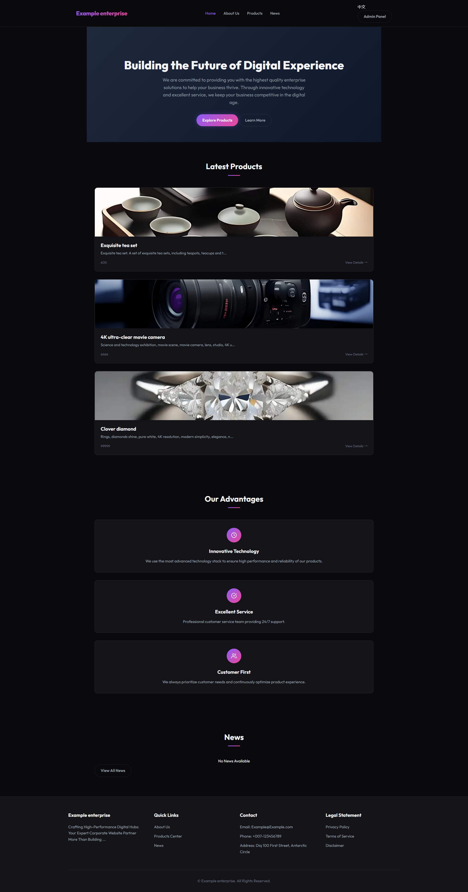
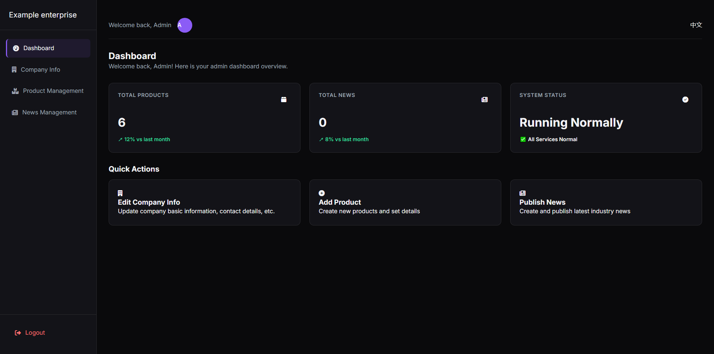

[English](README_en.md)|[German](README_de.md)|[中文](README_zh.md)|[日本語](README_ja.md)|[Русский](README_ru.md)|[한국어](README_ko.md)|Español|[Français](README_fr.md)|[Italiano](README_it.md)|[Português](README_pt.md)|[Nederlands](README_nl.md)|[Polski](README_pl.md)|[العربية](README_ar.md)|[हिन्दी](README_hi.md)|[ไทย](README_th.md)|[Svenska](README_sv.md)|[Türkçe](README_tr.md)|[Tiếng Việt](README_vi.md)

# Aplicación web Flask: sistema de gestión de sitios web empresariales (versión cifrada)

## Introducción al proyecto

Esta es una **versión cifrada** de un sistema de gestión de sitios web empresariales desarrollado en base al marco Flask. PyArmor ha ofuscado y cifrado el código central para proteger los derechos de propiedad intelectual.El sistema admite varios idiomas (chino e inglés), autenticación de usuarios, gestión de productos y noticias, visualización de información de la empresa y otras funciones.

## Captura de pantalla de la aplicación

La siguiente es una captura de pantalla de la interfaz principal de la aplicación:

### Inicio


### Experiencia en gestión


## Notas de la versión

Esta versión es una versión de cifrado básica que proporciona funciones completas de administración de sitios web corporativos.Si necesitas:

- **Versión completa del código fuente**: contiene código fuente completo sin cifrar para facilitar el desarrollo secundario
- **Desarrollo de funciones personalizadas**: personalización y expansión de funciones según sus necesidades específicas
- **Servicios de soporte técnico**: obtenga soporte técnico profesional y servicios de mantenimiento

Comuníquese con nosotros a través de la información de contacto a continuación y le proporcionaremos planos y cotizaciones detallados.

## Funciones de cifrado

- **Protección de código**: los archivos principales de Python (app.py, init_db.py, models.py) están ofuscados y cifrados
- **Protección en tiempo de ejecución**: use el entorno de ejecución de PyArmor para evitar que el código se descompile
- **Funcionalidad completa**: el código cifrado mantiene todas las funciones y características originales
- **Soporte multilingüe**: función integrada de cambio de chino e inglés

## Incluir archivos

```
/
├── app.py                  # Entrada de aplicación principal cifrada
├── init_db.py              # Script de inicialización de base de datos cifrada
├── models.py               # Modelos de datos cifrados
├── babel.cfg               # Configuración de internacionalización de Babel
├── pyarmor_runtime_000000/ # Archivos de soporte de tiempo de ejecución de PyArmor
├── static/                 # Archivos de recursos estáticos (CSS, JS, imágenes)
├── templates/              # archivos de plantilla HTML
├── translations/           # Archivos de traducción en varios idiomas
└── instance/               # Directorio de base de datos (creado automáticamente en la primera ejecución)
```

## Inicio rápido

### Requisitos medioambientales

- Python 3.9 o superior
- Paquetes de dependencia instalados:
- Matraz 3.0.0+
-Frasco-SQLAlchemy 3.1.1+
- Flask-Iniciar sesión 0.6.3+
- Matraz-Babel 4.0.0+
- Werkzeug 3.0.1+

### Instalar dependencias

Si las dependencias requeridas aún no están instaladas, instálelas primero:

```bash
pip install flask flask-sqlalchemy flask-login flask-babel werkzeug
```

### Ejecute la aplicación

1. **Inicializar base de datos**

Antes de ejecutarla por primera vez, es necesario inicializar la base de datos:

```bash
   python init_db.py
   ```

2. **Inicie la aplicación**

```bash
   python app.py
   ```

3. **Acceder a la aplicación**

Abra el navegador y visite: http://127.0.0.1:5000

## Instrucciones de uso

### Visitar sitio web

1. Abra el navegador y visite http://127.0.0.1:5000
2. Utilice el botón de cambio de idioma en la esquina superior derecha para cambiar entre chino e inglés.

### Experiencia en gestión

1. Visite http://127.0.0.1:5000/admin/login
2. Inicie sesión con la cuenta de administrador (nombre de usuario y contraseña predeterminados: admin/admin123)
3. Los productos, las noticias y la información de la empresa se pueden gestionar en el fondo de gestión.

## Descripción de la función

### Funciones de interfaz

- **Inicio**: muestra el perfil de la empresa y los principales productos.
- **Acerca de nosotros**: Mostrar detalles de la empresa
- **Visualización del producto**: explore todos los listados de productos
- **Actualizaciones de la industria**: vea las últimas noticias e información
- **Cambio de idioma**: admite el cambio entre chino e inglés

### Administrar funciones en segundo plano

- **Gestión de productos**: agregar, editar, eliminar productos
- **Gestión de noticias**: publicar, editar, eliminar noticias
- **Información de la empresa**: actualice la información básica de la empresa
- **Autenticación de usuario**: sistema de inicio de sesión seguro

## Guía de captura de pantalla

Para obtener el mejor efecto de visualización README, se recomienda crear y agregar capturas de pantalla de acuerdo con las siguientes pautas:

1. **Crear carpeta de capturas de pantalla**: cree la carpeta `screenshots/` en el directorio `dist/`
2. **Tamaño de captura de pantalla**: utilice una captura de pantalla con una resolución de 1920 x 1080 o 1366 x 768 para garantizar que el contenido sea claramente visible.
3. **Contenido de la captura de pantalla**:
- Página de inicio: muestra la interfaz completa de la página de inicio, incluida la barra de navegación y el área de contenido principal
- Cambio de idioma: muestra el efecto comparativo de cambiar entre chino e inglés (se pueden usar capturas de pantalla divididas)
- Visualización de productos: muestra la lista de productos y detalles de productos individuales.
- Página de noticias: muestra la lista de noticias y los detalles de las mismas.
- Backend de administración: muestra el panel y la interfaz funcional después de que el administrador inicia sesión
4. **Formato de captura de pantalla**: utilice el formato PNG para obtener la mejor calidad
5. **Nombre de archivo**: guarde la captura de pantalla según el nombre de archivo especificado en el archivo README (index.png, language_switch.png, etc.)

## Notas

1. **Integridad del archivo**: asegúrese de que todos los archivos se hayan descargado correctamente, especialmente el directorio `pyarmor_runtime_000000` y su contenido.

2. **Archivo de base de datos**:
- El archivo de base de datos se creará automáticamente en el directorio `instancia`
- Si necesita hacer una copia de seguridad de los datos, haga una copia de seguridad del archivo `instance/site.db` periódicamente

3. **Soporte multilingüe**:
- Todos los archivos de traducción están incluidos en el directorio `traducciones`
- Para agregar nuevos idiomas de traducción, consulte la documentación original del proyecto.

4. **Entorno operativo**:
- Asegúrese de que la versión de Python no sea inferior a 3.9
- Asegúrese de que todas las dependencias necesarias estén instaladas

5. **Consejos de seguridad**:
- Al implementar en un entorno de producción, cambie la contraseña de administrador predeterminada.
- Considere utilizar un servidor WSGI (como Gunicorn) en lugar del servidor de desarrollo.
- Configurar reglas de firewall apropiadas

## Recomendaciones de implementación

### Entorno de desarrollo

Utilice el servidor de desarrollo integrado de Flask (que se muestra en el inicio rápido anterior).

### Entorno de producción

1. **Utilice el servidor WSGI**:
```bash
   pip install gunicorn
   gunicorn -w 4 -b 0.0.0.0:8000 app:app
   ```

2. **Usar proxy inverso**:
- Configurar Nginx o Apache como proxy inverso
- Configurar el certificado SSL para habilitar HTTPS

3. **Optimización de la base de datos**:
- Considere usar PostgreSQL o MySQL en lugar de SQLite
- Configurar el mecanismo de copia de seguridad regular

## Solución de problemas

### Preguntas frecuentes

1. **La aplicación no se puede iniciar**:
- Verifique si la versión de Python cumple con los requisitos.
- Confirme que todos los paquetes dependientes estén instalados correctamente
- Verifique si el directorio `pyarmor_runtime_000000` existe y está completo

2. **El cambio de idioma no funciona**:
- Confirmar que el directorio `traducciones` y su contenido estén completos
- Compruebe si la configuración de cookies del navegador está permitida.

3. **Error de conexión a la base de datos**:
- Confirme que el directorio `instancia` existe y tiene permisos de escritura
- Intente volver a ejecutar `init_db.py` para inicializar la base de datos.

### Vista de registro

Cuando se inicia la aplicación, la información de registro se mostrará en la consola. Si tiene problemas, puede consultar estos registros para obtener más información.

## Licencia

__ENLACE_7__

## Información de contacto

Si tiene alguna pregunta, sugerencia o necesita una versión completa o desarrollo de funciones personalizadas, comuníquese a través de los siguientes métodos:

- **Correo electrónico**: austinlive666@gmail.com (recomendado)
- **Discordia**:[https://discord.gg/7AN9PuGn](https://discord.gg/7AN9PuGn)

---

¡Gracias por usar este proyecto!